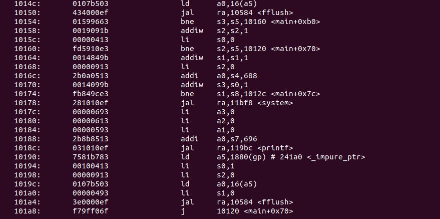

# Task 2:

- For this task, I decided to create a simple digital clock, using C due to the time constraints. I plan to use this program with the VSDSquadron Mini to build a Nyxie Alarm Clock.

- Here is the code for the Digital Clock:

        #include <stdio.h>
        #include <time.h>
        #include <unistd.h>
        #include <stdlib.h>

        int main() {
        int hour = 0;
        int minute = 0;
        int second = 0;
        while(1) {
            system("clear"); 
            
            // Print the time in HH : MM : SS format
            printf("%02d : %02d : %02d ",hour,minute,second);
            
            // Clear the output buffer in gcc
            fflush(stdout);
            
            // Increment second
            second++;

            // Update hour, minute and second
            if(second == 60) {
                minute += 1;
                second = 0;
            }
            
            if(minute == 60) {
                hour += 1;
                minute = 0;
            }
            
            if(hour == 24) {
                hour = 0;
                minute = 0;
                second = 0;
            }

            // Wait for 1 second
            sleep(1);  
        }
        return 0;
        }

- The code successfully compiled using gcc, O1 and Ofast compilers. Snapshots of successfull compilation below:

    

- Here is a snapshot of the objdump, assembly code for O1, and Ofast profiles respectively:

    O1 assembly code:
    
    

    Ofast assembly code:
    
    
