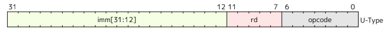

# Task 3:

## RISC V ISA:

RISC-V is a new instruction-set architecture that was originaly desgned to support computer architecture research and eductaion, but which now hopes to become an architecture for industry implementations as well.

A RISC-V hardware platform can contain one or more RISC-V-compatible processing cores together with other non-RISC-V-compatible cores, fixed-function accelerators, various physical memory structures, I/O devices, and an interconnect structure to allow the components to communicate.

A RISC-V ISA is defined as a base integer ISA, which must be present in any implementation, plus optional extensions to the base ISA. The base integer ISAs are very similar to that of the early RISC processors except with no branch delay slots and with support for optional variable-length instruction encodings.

## Types of Instructions:

We'll be taking a look at the RV32I base integer instruction set, for the RISC-V architecture, as that is what we mostly use throughout this internship.

For this specific architecture, instructions are 32-bit wide, and we have access to 32 unprivileged registers. Though, of these unprivileged registers, it is a standard to use x1 as a link register, x2 as the stack pointer and x5 as an alternate link register. The program counter has its own register.

RISC-V instructions can be split up into 5 main catrgories:
- R Type - Register Instructions
- I Type - Immediate Instructions
- S Type - Store Instructions
- B Type - Branch Instructions
- U Type - Upper-Immediate Instructions
- J Type - Jump Instructions

### Register Type Intructions

- Used for arithmetic and logical operations that involve registers.
- Typically have 2 source and 1 destination register.
- Fields:
    - `opcode` : 
    - `rd` :
    - `funct3` :
    - `rs1` : 
    - `rs2` : 
    - `funct7` :
- Example: ``

### Immediate Type Instructions

- Instruction with an immediate (constant) value, typically used for operations that involve a constant operand, like load instructions or environment call/returns.
- Fields:
    - `opcode` : 
    - `rd` :
    - `funct3` :
    - `rs1` : 
    - `imm[11:0]` :
- Example: ``

### Store Type Instructions

- Used for store operations, where a value from a register is stored into memory.
- Fields:
    - `opcode` : 
    - `imm[4:0]` :
    - `funct3` :
    - `rs1` :
    - `rs2` :
    - `imm[11:5]` :
- Example: ``

### Branch Type Instructions

- Conditional branch instructions, used to alter the flow of execution based on the result of a comparison.
- Fields:
    - `opcode` : 
    - `imm[11]` :
    - `imm[4:1]` : 
    - `funct3` :
    - `rs1` :
    - `rs2` :
    - `imm[10:5]` :
    - `imm[12]` :
- Example: ``

### Upper-Immediate Type Instructions

- Used for instructions that operate on upper immediate values, such as loading a 20-bit immediate into the upper bits of a register.
- Fields:
    - `opcode` : 
    - `rd` : 
    - `imm[31:12]` :
- Example: ``

### Jump Type Instructions

- Used for jump instructions, which are unconditional control transfers.
- Fields:
    - `opcode` : 
    - `rd` :
    - `imm[19:12]` :
    - `imm[11]` :
    - `imm[10:1]` :
    - `imm[20]` :
- Example: ``

### Special Implementation

The No-Op instruction is crucial to facilitate pipelining of a procesor, and is hence a part of all ISAs today. For this architecture, the NOP Instruction is encoded as `addi x0, x0, 0`.

### Summary of 15 RISC-V Instructions with 32-Bit Encoding

| Assembly Instruction   | Instruction Type | Encoding (Hexadecimal)  | Function |
|------------------------|------------------|-------------------------|----------|
| ``                     | -Type           | ``                      |          |
| ``                     | -Type           | ``                      |          |
| ``                     | -Type           | ``                      |          |
| ``                     | -Type           | ``                      |          |
| ``                     | -Type           | ``                      |          |
| ``                     | -Type           | ``                      |          |
| ``                     | -Type           | ``                      |          |
| ``                     | -Type           | ``                      |          |
| ``                     | -Type           | ``                      |          |
| ``                     | -Type           | ``                      |          |
| ``                     | -Type           | ``                      |          |
| ``                     | -Type           | ``                      |          |
| ``                     | -Type           | ``                      |          |
| ``                     | -Type           | ``                      |          |
| ``                     | -Type           | ``                      |          |