# Task 4:

This task requires us to simulate some C/Assmebly code on a netlist - Soft Copy - of a RISC-V processor. Usually the execution of programs requires instructions to be loaded into L-1 Cache from Lower levels of Memory, but to keep the process simple, we have hardcoded the instructions in their 32-bit pattern as can be seen below. Since the machine we are using to simulate the execution of instrcutions is not the exact same as a typical RISC-V machie, and has some chnages in architecture, the bit pattern in the machine code is slightly different.

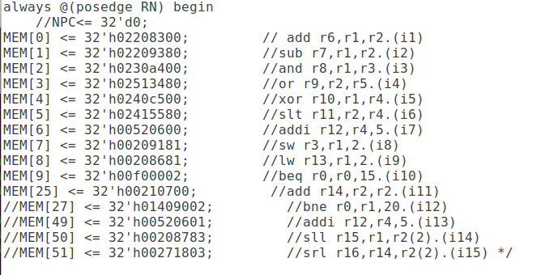

- We have 2 files that help us simulate the flow of a program:
    - `av2174_rv32i.v` : this is a verilog model of a RISC-V processor with the RV32I architecture, and also contains the hard-coded instructions
    - `av2174_rv32i_tb.v` : this is the test bench file, andwhat the simulator actualy runs on, this generates a clk signal for the processor to run on, and allows us to see the workings of the processor during program execution.
- First, we use the following commands to generate a `iverilog` object file, which we then execute.
    
    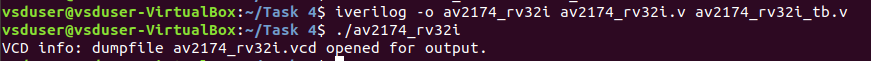

- Executing the Object File, gives us a vcd file, which can then be used on the Output Waveform Viewer to observe the cycle-by-cycle execution of program instructions.

- We run the `$ gtkwave av2174_rv32i.vcd` command on the received `vcd` file to see the GTKWave window pop up, which we can use for analysis.

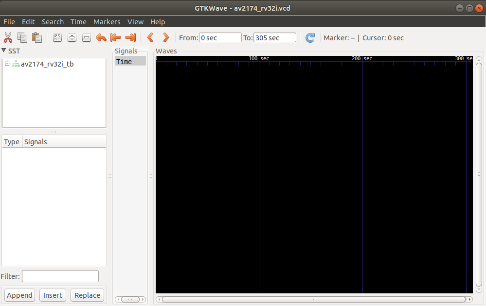

## Step By Step Analysis of Instructions (cycle-by-cycle)

The Window on the left in all the screenshots show the instruction code for current instructions, values of both registers addressed, and ALU output.

- Instruction 1: `add r6, r1, r2`

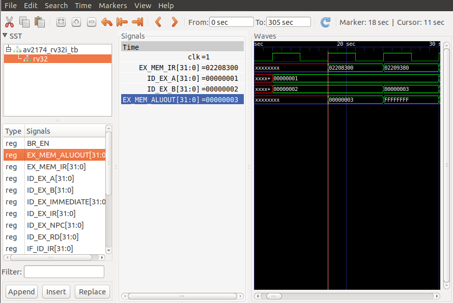

- Instruction 2: `sub r7, r1, r2`

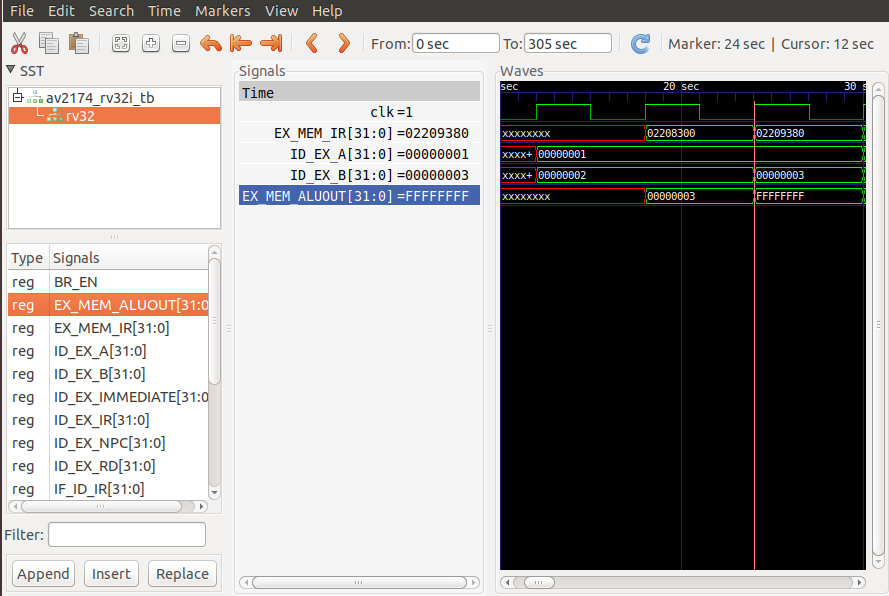

- Instruction 3: `and r8, r1, r3`

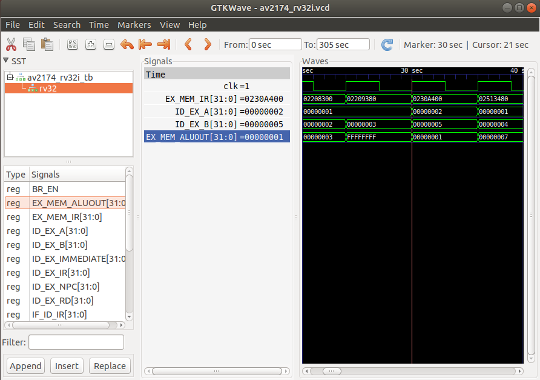

- Instruction 4: `or r9, r2, r5`

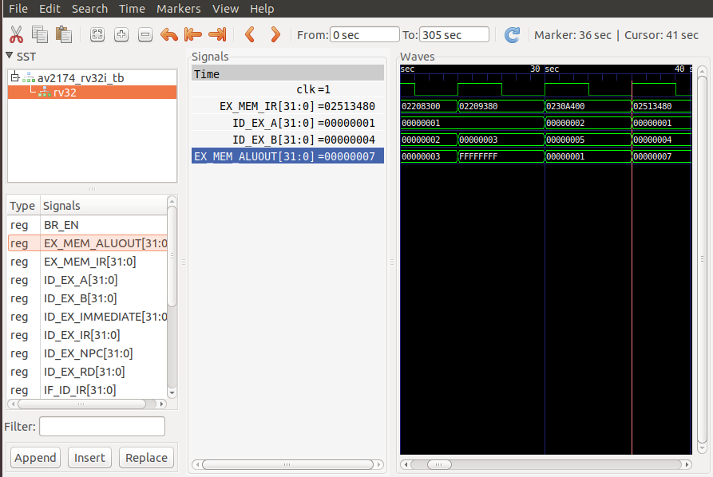

- Instruction 5: `xor r10, r1, r4`

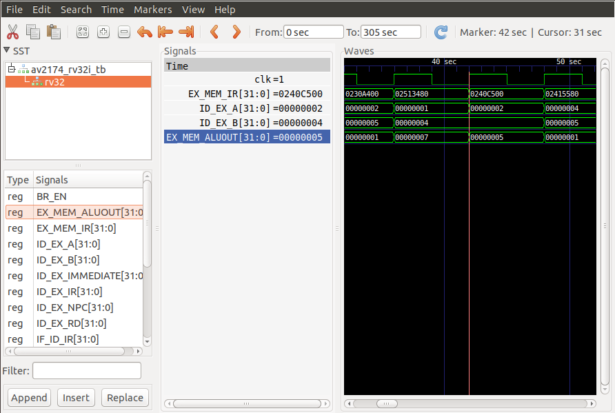

- Instruction 6: `slt r11, r2, r4`

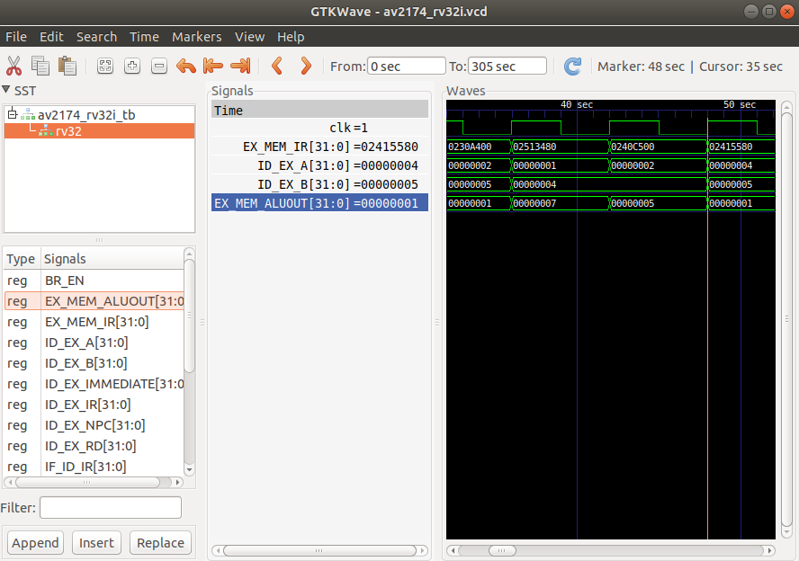

- Instruction 7: `addi r12, r4, 5`

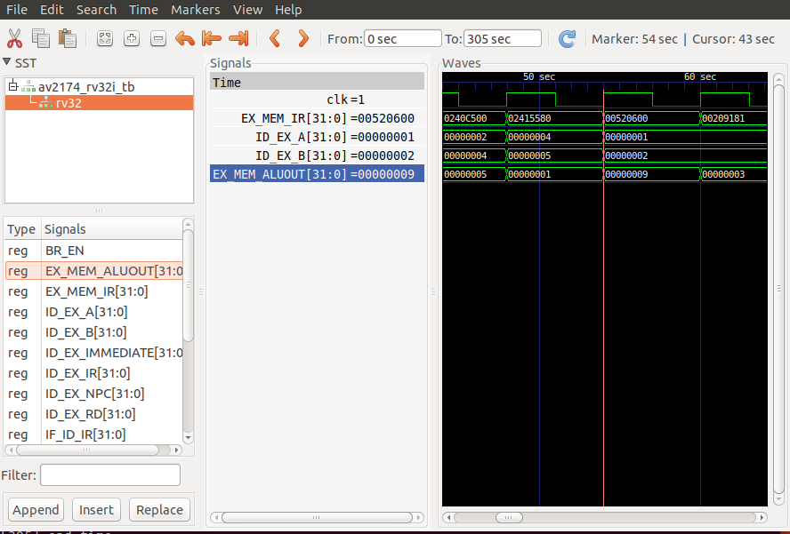

- Instruction 8: `sw r3, r1, 2`

- Instruction 9: `lw r13, r1, 2`

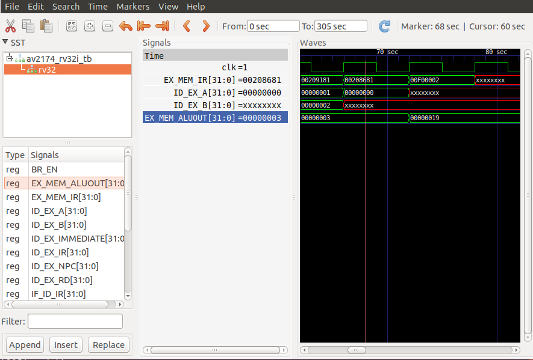

- Instruction 10: `beq r0, r0, 15`

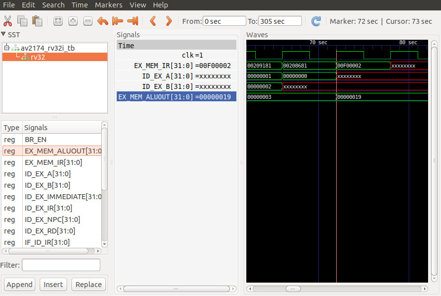

- Instruction 11: `add r14, r2, r2`

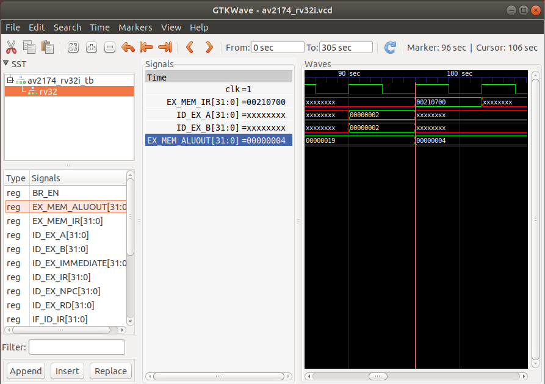

- Instruction 12: `bne r0, r1, 20`

- Instruction 13: `addi r12, r4, 5`

- Instruction 14: `sll r15, r1, r2`

- Instruction 15: `srl r16, r14, r2`
