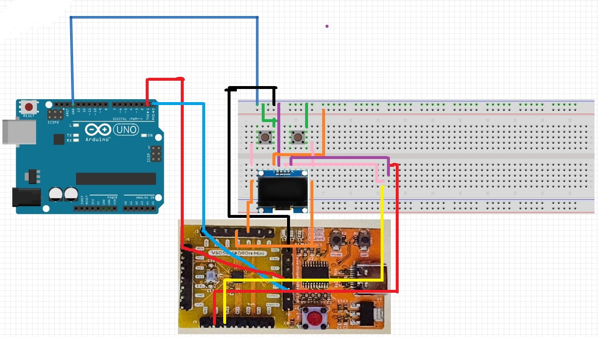

# Macro Pad with Volume Control using VSD Squadron Mini

## Overview
This project aims to act as a proof of concept and somewhat of a testing stage for a bigger Project that I have in Mind - A 9 Key MacroPad with Each Key Display and Control Knobs. The Project for this Internship involves utilizing the VSDSquadron Mini Board, and the CH32 framework to program 2 Macro Keys,  and a Display for Macro Functions. The Project utilizes I2C communication to display images on the OLED Display, and USART communication alongside Pyhton Scripts to Perform Operatons on a Windows 11 machine, in accordance with the input received from the Keys and Volume Knob. This project demonstartes the capabilities of the VSDSquadronMini Board, by showcasing it's compatibility with Serial Communication Standards like USART, and I2C.
## Components Required
- VSD Squadron Mini
- 2 Key Switches for Macro Input
- OLED Screen for Button Mapping Display
- Arduino Uno R4
- BreadBoard
- Jumper Wires
- VS Code
- Arduino IDE

## Hardware Connections
- **Input:** 3 Input GPIO pinis are required, 2 are in Digital Mode (Mechanical Keys) .
- **Output:** The 0.96 inch display is connected to PC1(SDA), PC2(SCL), 5V(VDD) and GND for I2C communcation with the OLED Display.
- Also, the TX & RX pins on the VSD and Arduino are conneted to allow Serial Communication.



## Source Code: VSD
```
#include <oled_small.h>

#define BUTTON1 PD1
#define BUTTON2 PD2

struct Buttons{
  byte button1;
};

Buttons data;

void setup() {

  pinMode(BUTTON1, INPUT);
  pinMode(BUTTON2, INPUT);

  data.button1 = 0;

  I2C_init();
  OLED_init();
  OLED_setpos(0,0);
  OLED_clear();
  OLED_print("Hello User!");
  delay(1000);
  OLED_DrawBitmap(0, 0, 128, 64, img2_bmp, false);

  Serial.begin(9600);
  Serial.setTimeout(200);
  Serial.println("Now starting");

}

void screen()
{
  OLED_DrawBitmap(0, 0, 128, 64, img2_bmp, false);
}

void loop() {
  // put your main code here, to run repeatedly:

  int button1State = digitalRead(BUTTON1);
  int button2State = digitalRead(BUTTON2);
  data.button1 = (button1State)? 0 : (button2State)? 1 : 2;

  if(button1State == 0)
  {
    //digitalWrite(LED1, HIGH);

    OLED_clear();
    OLED_print("Button1 pressed!");

    delay(500);
  }
  else
  {
    //digitalWrite(LED1, LOW);
    screen();
    delay(500);
  }

  int button2State  = digitalRead(BUTTON2);
  if(button2State == 0)
  {
     //digitalWrite(LED2, HIGH);

     OLED_clear();
     OLED_print("Button2 pressed!");
     delay(500);
   }
   else
   {
     //digitalWrite(LED2, LOW);
     screen();
     delay(500);
   }

  Serial.write((byte*)&data, sizeof(data));
  delay(100);

}

```
## Source Code: Arduino
```
#include <Keyboard.h>

struct Buttons{
  byte button1;
};

Buttons data;

void setup() {
  // put your setup code here, to run once:

  data.button1 = 0;

  Serial.begin(9600);
  Serial.println("Program Started");

  Keyboard.begin();

}

void openArduino()
{
  Serial.println("Arduino Opened");
  Keyboard.press(KEY_LEFT_CTRL);
  Keyboard.press(KEY_LEFT_ALT);
  Keyboard.press('a');
  Keyboard.releaseAll();
  delay(1000);
}

void openNotion()
{
  Serial.println("Notion Opened");
  Keyboard.press(KEY_LEFT_CTRL);
  Keyboard.press(KEY_LEFT_ALT);
  Keyboard.press('n');
  Keyboard.releaseAll();
  delay(1000);
}

int received ;
void loop() {
  // put your main code here, to run repeatedly:
  //Serial.println(Serial.read());
  digitalWrite(LED, LOW);
  if(Serial.available() >= sizeof(data))
  {
    Serial.readBytes((byte*)&data, sizeof(data));

    Serial.print("Now communicating");
    if(data.button1 == 1) openNotion();
    else if(data.button1 == 2) openArduino();
  }

  delay(200);

}

```

## Demo Video

https://github.com/user-attachments/assets/f7156111-4394-469e-8d1b-3f8bc28fbf41

